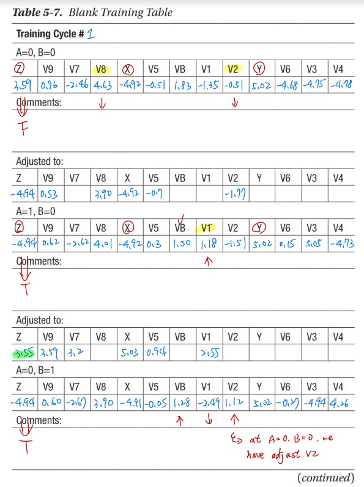
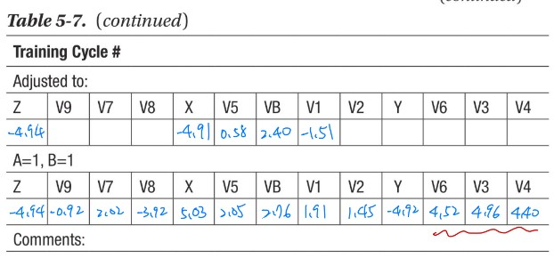

# MatLab 
URL: [Click to webpage](https://www.mathworks.com/products/matlab.html)

Matlab is the second tool I learned for machine learning, and MatLab is also a powerful software to make a figure which I used to do the data analysis. And here I'll put some simple neural networks with some concepts, and make the descriptions of these methods how they worked.

p.s. If there's some mistakes pls tell me.

### Midtern
Build the structure of the simple nueral network.

Midterm Report: [Click to webpage](https://docs.google.com/presentation/d/1MeRIWdv8zwScGjTOptPkSyRtgxtvUUjbW09RtjhKVCM/edit?usp=sharing)

### Final
Implementation the hardware.

